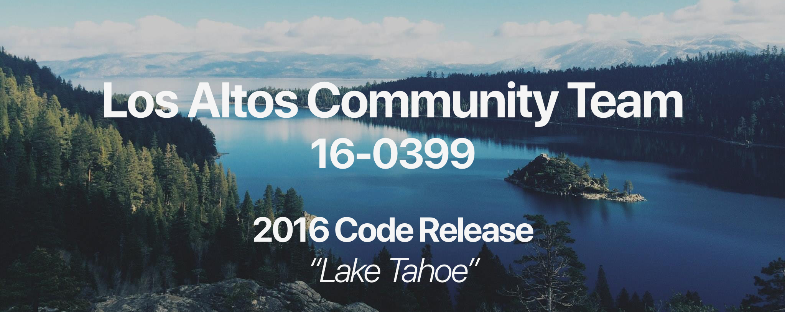

## Los Altos Community Team 16-0399 Code Release of the 2016 Season

### Leadership
* Head Captain - Daniel Wang
* Programming/Build Captain - Oscar Bjorkman

### Competition Results
* 4th Place Seeding at GCER
* Top 16 Double Elimination
* Best Robot Subsystem
* 1st Place Overall at NorCal Regional

### Details
We were the "seeding" sub-team that attended GCER, yet we also happened to build some highly dominant Double Elimination robots. Notably, we had a Link that employed an igus chain and lots of c-channel to completely cut the opponent's side in half.

### Usage
Feel free to take a look at the code and make use of it on your own robots. However, please don't pass the code off as your own!

### License
MIT
